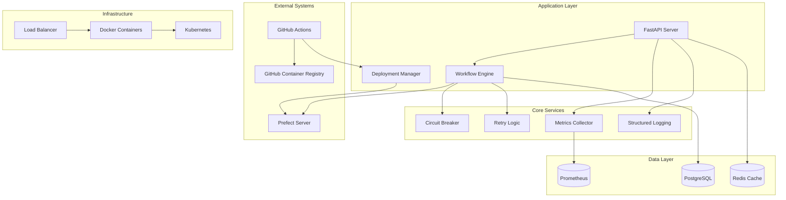
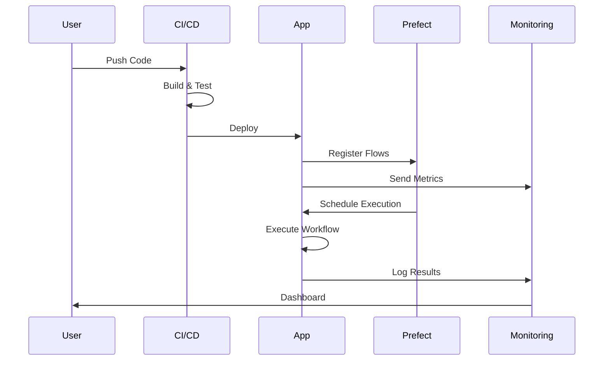

# 🏗️ Architecture Documentation

## Overview

This production-grade Prefect CI/CD application is designed with scalability, reliability, and maintainability in mind. The architecture follows cloud-native principles and implements enterprise patterns for workflow orchestration.

## System Architecture

## Component Architecture

### 1. Configuration Management
- **Pydantic-based Settings**: Type-safe configuration with validation
- **Environment-specific configs**: Development, staging, production
- **Secret management**: Integration with vault systems
- **Hot-reload capability**: Dynamic configuration updates

### 2. Workflow Engine
- **Prefect Integration**: Native Prefect flow and task decorators
- **Async Support**: Fully async workflow execution
- **Parallel Processing**: Concurrent task execution
- **State Management**: Persistent workflow state

### 3. Error Handling & Resilience
- **Circuit Breaker Pattern**: Prevents cascading failures
- **Exponential Backoff**: Smart retry logic with jitter
- **Graceful Degradation**: Fallback mechanisms
- **Timeout Management**: Configurable timeouts at all levels

### 4. Monitoring & Observability
- **Prometheus Metrics**: Custom metrics for all operations
- **Structured Logging**: JSON-formatted logs with correlation IDs
- **Health Checks**: Liveness and readiness probes
- **Distributed Tracing**: OpenTelemetry integration

### 5. Security
- **JWT Authentication**: Token-based auth
- **Input Validation**: Comprehensive input sanitization
- **Secret Rotation**: Automatic credential rotation
- **Security Scanning**: Container and dependency scanning

## Data Flow

## Deployment Architecture

### Container Strategy
- **Multi-stage builds**: Optimized image size
- **Distroless runtime**: Enhanced security
- **Layer caching**: Fast builds
- **Health checks**: Container health monitoring

### Orchestration
- **Docker Swarm/Kubernetes**: Container orchestration
- **Auto-scaling**: Horizontal pod autoscaling
- **Rolling updates**: Zero-downtime deployments
- **Service mesh**: Istio/Linkerd integration ready

### High Availability
- **Replica sets**: Multiple application instances
- **Load balancing**: Traffic distribution
- **Failover**: Automatic failover mechanisms
- **Disaster recovery**: Backup and restore procedures

## Technology Stack

### Core Technologies
- **Python 3.12**: Latest Python features
- **Prefect 2.x**: Modern workflow orchestration
- **FastAPI**: High-performance API framework
- **Pydantic**: Data validation
- **SQLAlchemy**: ORM for database operations
- **Redis**: Caching and session management

### Infrastructure
- **Docker**: Containerization
- **Kubernetes**: Container orchestration
- **Prometheus**: Metrics collection
- **Grafana**: Metrics visualization
- **Jaeger**: Distributed tracing
- **PostgreSQL**: Primary database

### Development Tools
- **pytest**: Testing framework
- **black**: Code formatting
- **mypy**: Static type checking
- **bandit**: Security linting
- **pre-commit**: Git hooks

## Design Patterns

### Implemented Patterns
1. **Circuit Breaker**: Fault tolerance
2. **Retry with Backoff**: Transient failure handling
3. **Repository Pattern**: Data access abstraction
4. **Factory Pattern**: Object creation
5. **Singleton**: Configuration management
6. **Observer**: Event-driven architecture
7. **Strategy**: Pluggable algorithms
8. **Decorator**: Cross-cutting concerns

## Performance Considerations

### Optimization Strategies
- **Connection pooling**: Database and HTTP connections
- **Caching**: Multi-level caching strategy
- **Async I/O**: Non-blocking operations
- **Batch processing**: Efficient data processing
- **Lazy loading**: On-demand resource loading

### Benchmarks
- **API Response Time**: < 100ms p95
- **Workflow Execution**: < 5s for simple flows
- **Deployment Time**: < 2 minutes
- **Container Startup**: < 10 seconds
- **Health Check Response**: < 1 second

## Security Architecture

### Security Layers
1. **Network Security**: TLS/SSL, firewall rules
2. **Application Security**: Input validation, CSRF protection
3. **Data Security**: Encryption at rest and in transit
4. **Access Control**: RBAC, JWT authentication
5. **Audit Logging**: Comprehensive audit trail

### Compliance
- **GDPR**: Data privacy compliance
- **SOC 2**: Security controls
- **ISO 27001**: Information security
- **PCI DSS**: Payment card security (if applicable)

## Scalability

### Horizontal Scaling
- **Stateless design**: No server-side state
- **Load balancing**: Round-robin, least connections
- **Database sharding**: Data partitioning
- **Cache distribution**: Redis cluster

### Vertical Scaling
- **Resource limits**: CPU and memory constraints
- **Auto-scaling policies**: Metric-based scaling
- **Performance tuning**: JIT compilation, profiling

## Disaster Recovery

### Backup Strategy
- **Database backups**: Daily automated backups
- **Configuration backups**: Version controlled
- **Log retention**: 30-day retention policy
- **Disaster recovery plan**: RTO < 4 hours, RPO < 1 hour

### Monitoring & Alerting
- **SLI/SLO/SLA**: Service level objectives
- **Alert policies**: PagerDuty integration
- **Runbooks**: Automated remediation
- **Post-mortems**: Incident analysis

## Future Enhancements

### Roadmap
1. **GraphQL API**: Alternative API interface
2. **WebSocket support**: Real-time updates
3. **Multi-tenancy**: Isolated tenant environments
4. **ML Integration**: Predictive analytics
5. **Edge deployment**: Edge computing support